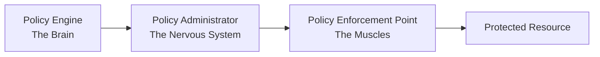
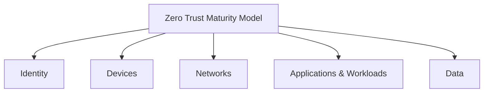

# Zero Trust: Why "Never Trust, Always Verify" Became My Security Mantra

[](https://github.com/scthornton)
[](https://github.com/scthornton)
[](https://www.linkedin.com/in/scthornton)

---

## 🚨 The Moment Security Changed

Picture this: You're sitting in a SOC at 3 AM, watching alerts cascade across your screens. Another breach. But here's the kicker—they didn't break through the firewall. They went right around it. Legitimate credentials. Lateral movement through systems that implicitly trusted one another. Sound familiar?

That was the moment it clicked. Firewalls are still essential (I should know; I work for the largest firewall maker in the world), but they can't be our only line of defense. We needed a security approach that didn't assume trust just because traffic had crossed the perimeter.

Enter Zero Trust, the security model that complements your firewall strategy by requiring verification at every step. And trust me (pun intended), after more than 25 years in networking and security, this isn't just another industry buzzword. Rather, Zero Trust is a necessary evolution in how we secure modern infrastructures.

In this guide, I'll walk through what Zero Trust really means, why it matters, and how to implement it without losing your sanity. Whether you're a fellow security engineer or just trying to understand why your IT team keeps muttering "trust no one" like they're quoting The X-Files, this is for you.

---

## 🎯 What the Heck is Zero Trust Anyway?

Forget the jargon for a moment. The Zero Trust security model is like that friend who checks everyone's ID at their own house party, even yours, even if you've been friends forever. It aims to verify every single access attempt, no matter how familiar the source seems.

> **The official definition**: Zero Trust is "a collection of concepts and ideas designed to minimize uncertainty in enforcing accurate, least privilege per-request access decisions in information systems and services in the face of a network viewed as compromised."

> **The human translation**: Assume everything and everyone is trying to hack you until proven otherwise. Every. Single. Time.

Paranoid? More like proactive and smart. In a Zero Trust Architecture (ZTA), we verify everything continuously. Think of it like this:

| Traditional Security                                               | Zero Trust                                                                                      |
| ------------------------------------------------------------------ | ----------------------------------------------------------------------------------------------- |
| "Oh, you're inside the building? Cool, help yourself to anything!" | "You're inside the building? Excellent. Now show me your badge at every door you want to open." |

### 📜 The Seven Commandments of Zero Trust

NIST (the folks who set standards for pretty much everything) laid out seven foundational tenets of Zero Trust. I like to think of these as the "Seven Commandments" of modern cybersecurity:

1. **🔧 Everything is a resource** - From data and cloud apps to that ancient printer in accounting, if it connects to your network, it counts.

2. **🌍 Location means nothing** - Working from headquarters or a beach in Bali? The same security rules apply.

3. **🎯 One resource at a time** - Just because you can access email doesn't mean you get the keys to the kingdom.

4. **🔄 Policies are dynamic** - Access decisions adapt to the situation. Accessing payroll at 3 AM from Russia? Yeah, we'll need extra verification.

5. **👁️ Monitor everything** - If it's connected, we're watching it. It's how we keep the bad guys out, plain and simple.

6. **🔐 Authenticate and authorize always** - It's like TSA ID checks at every gate, every time.

7. **📊 Collect, analyze, improve** - Logging, analysis, and feedback loops are your friends. Use them to get smarter about threats.

---

## 🏰 Why Traditional Network Security Fails (and how Zero Trust Solves It)

Back in the late '90s and early 2000s, we all believed in the "castle and moat" approach. Build a big firewall, put everything important inside, and call it a day. The guy who invented the firewall trust model literally came up with the term "trust" in his garage. We've been living with the consequences of that arbitrary decision ever since.

John Kindervag at Forrester was the first to call BS on this whole approach. His research validated what many of us had begun to suspect: traditional networks were too trusting. Famously described as "chewy networks," they were secure on the outside but soft and vulnerable on the inside, and they were getting breached left and right.

### 💥 The Wake-Up Calls

- **OPM breach (2015)** - 22 million sensitive records stolen
- **Equifax (2017)** - Personal data on 147 million people compromised  
- **SolarWinds (2020)** - Supply chain attack that rippled across industries

Trusting their network perimeter alone, these organizations might as well have been operating submarines with screen doors.

---

## ⚙️ How Zero Trust Architecture Works: Components & Workflow

Zero Trust is more than just a philosophy. It's a practical architecture built on key components that work together to secure your systems.

### 🧠 Key Zero Trust Components

Zero Trust relies on three core components: the brain (decision-making), the nervous system (coordination), and the muscles (enforcement).



1. **Policy Engine** - The Brain
   - Makes all the decisions
   - Takes input from everywhere (threat intel, user behavior, device health)
   - Basically, the bouncer deciding who gets in

2. **Policy Administrator** - The Nervous System
   - Communicates decisions from the brain (Policy Engine) to the muscles (Policy Enforcement Point)
   - Coordinates how and when policies are applied across the environment
   - The middle manager of the security world

3. **Policy Enforcement Point** - The Muscles
   - Blocks or allows access
   - The hands-on enforcer
   - Where the rubber meets the road

### 🛡️ The Supporting Cast

These systems feed critical content and data to your Policy Engine, allowing for smarter decisions:

| System                  | Purpose                                              |
| ----------------------- | ---------------------------------------------------- |
| **CDM**                 | Tracks device health and compliance status           |
| **SIEM**                | Your security data lake, aggregating logs and alerts |
| **Threat Intelligence** | Real-time awareness of emerging threats              |
| **Identity Management** | Verifies user identity                               |
| **PKI**                 | Strong, certificate-based authentication             |

### 🚀 Steps for Implementing Zero Trust

Here's my proven, practical approach to implementing Zero Trust in your environment:

```
1. 🗺️  Map your stuff - You can't protect what you don't know exists
2. 🔄  Understand your flows - How does data move through your org?
3. 📝  Write policies - Start simple, get complex later
4. 🎯  Pick your enforcement points - Where will you check credentials?
5. 📊  Monitor like crazy - You'll need the data
6. 🔨  Deploy incrementally - Rome wasn't built in a day
7. ♻️  Iterate forever - Seriously, this never ends
```

### 🎨 Three Common Ways to Implement a Zero Trust Model

There are three primary ways to approach Zero Trust implementation:

#### 1. Identity-Centric
Access revolves around who you are, verified continuously through identity and authentication systems.

> **Example**: A financial services firm uses adaptive MFA that increases authentication requirements based on user behavior patterns and risk scores. Accessing wire transfer systems from a new location triggers additional biometric verification.

#### 2. Network Micro-segmentation
Slice and dice your network into smaller, isolated segments to prevent lateral movement by attackers.

> **Example**: A hospital segments its network so medical devices, administrative systems, and guest WiFi are completely isolated. Even if attackers compromise the guest network, they can't reach patient records or medical equipment.

#### 3. Software-Defined Perimeters
Use encrypted overlay networks, often enabled by Software-Defined Networking (SDN), to dynamically control access and hide internal resources from unauthorized users.

> **Example**: A global consulting firm uses SDP to create secure, encrypted tunnels for each user session. Remote consultants can only see and access the specific client resources they need, with all other systems remaining invisible.

Most organizations adopt a hybrid approach that works best with their environment, risk tolerance, and existing architecture. There's no one-size-fits-all here.

---

## 🌟 Why Zero Trust Matters More Than Ever

Look, I could throw statistics at you all day, but we must acknowledge that the way we work has fundamentally changed. So have the threats.

### 🚦 "Why Now?"

- **☁️ Cloud Everything**: Your data isn't in a central data center anymore, but rather, spread across multiple cloud environments.
- **🏠 Remote Work**: Your perimeter now includes every employee's home network and coffee shop WiFi.
- **📱 BYOD Madness**: Personal devices are accessing corporate resources.
- **🔗 Supply Chain Attacks**: Even your vendors can't be trusted.
- **🤖 AI-Powered Attacks**: The bad guys have robots now.

### ✅ Benefits of Zero Trust

After helping implement Zero Trust across multiple organizations, here's what I've found improves:

| Benefit                  | Impact                                                    |
| ------------------------ | --------------------------------------------------------- |
| **Smaller blast radius** | When (not if) a breach happens, it's contained by default |
| **Better visibility**    | You understand what's happening in your network           |
| **Easier compliance**    | Auditors love granular controls and audit trails          |
| **Happier users**        | Once they get used to it (okay, this takes time)          |

### ⚠️ Zero Trust Challenges

Zero Trust brings real security gains, but I'd be doing you a disservice if I didn't acknowledge its pain points:

- **🏛️ Legacy systems**: That 20-year-old mainframe won't adopt Zero Trust on its own
- **💰 Initial cost**: Your CFO will notice the investment
- **😤 User experience**: Balance security with usability
- **⚡ Performance**: All that checking adds compute load
- **🙅 Cultural resistance**: "But we've always done it this way!"

### 🚫 Debunking the Myths

Let me clear up a few common misconceptions about Zero Trust:

| Myth                                     | Reality                                  |
| ---------------------------------------- | ---------------------------------------- |
| "Zero Trust means trust nothing"         | It means verify everything, continuously |
| "It's just network segmentation"         | It's way larger than that                |
| "You need to rip and replace everything" | It's meant to be incremental             |
| "It's just another product to buy"       | It's an architecture, not a SKU          |

---

## 🏛️ Government Endorsement & Global Momentum

When the feds mandate something, you know it's serious. Executive Order 14028, issued in May 2021, effectively declared, "Everyone gets Zero Trust by 2024!". The CISA Zero Trust Maturity Model came next as a practical roadmap built around five pillars:



Each pillar is measured across four maturity levels: 

**Traditional → Initial → Advanced → Optimal**

Other countries are jumping on board too—Australia, Singapore, and the UK have each launched their own Zero Trust initiatives. Zero Trust is becoming a global movement, like the secret weapon in a cybersecurity Olympics.

---

## 🤝 Zero Trust Plays Nice with Others

One of the best parts about Zero Trust? It integrates with existing frameworks.

### 🔧 Framework Integration

- **NIST Cybersecurity Framework**: Zero Trust enhances all five functions (Identify, Protect, Detect, Respond, and Recover)
- **Risk Management Framework**: Adds depth with continuous monitoring and adaptive controls
- **Cloud Security**: Finally, a way to secure hybrid and multi-cloud environments
- **AI/ML Security**: Zero Trust principles are critical for protecting AI systems and data

### 🤖 AI/ML Security Deep Dive

As someone deep in the AI space, I've seen how Zero Trust helps:

- **🛡️ Protect training data** and model weights from unauthorized access or poisoning
- **🔐 Implement fine-grained access controls** for different model versions and environments
- **📊 Monitor and log** all interactions with AI systems for compliance and security
- **🚫 Prevent model extraction attacks** by controlling API access and rate limiting
- **✅ Ensure secure model deployment** pipelines with verified code and data integrity

---

## 📋 Your Zero Trust Implementation Plan

Convinced yet? Here's a practical roadmap to help you get started with Zero Trust.

### 🏃 Quick Wins (Week 1-4)
- [ ] Enable MFA everywhere (seriously, everywhere)
- [ ] Start inventorying your assets
- [ ] Implement least privilege access
- [ ] Begin monitoring user behavior

### 🎯 Medium-term Goals (Month 2-6)
- [ ] Deploy network microsegmentation
- [ ] Implement device trust scoring
- [ ] Build your policy engine
- [ ] Create dynamic access policies

### 🚀 Long-term Vision (Month 6+)
- [ ] Achieve full Zero Trust Architecture
- [ ] Automate threat response
- [ ] Use AI-powered policy decisions
- [ ] Continuously evaluate trust

---

## 🎬 Conclusion

Zero Trust is not simply a passing trend. It represents a fundamental shift in how we think about protecting our digital assets. Is it perfect? No, but it is essential.

The question isn't whether you should implement Zero Trust, but how quickly you can start. While you're reading this, someone is already testing your defenses. In today's environment, assuming your systems will be breached is realistic.

> **Remember**: In Zero Trust, paranoia isn't a bug, it's a feature.

---

## 📚 Resources to Get You Started

- 📖 [NIST SP 800-207](https://csrc.nist.gov/publications/detail/sp/800-207/final) - Authoritative Zero Trust reference from NIST
- 🎯 [CISA Zero Trust Maturity Model](https://www.cisa.gov/zero-trust-maturity-model) - Federal roadmap for moving from basic to advanced Zero Trust
- 🔨 [NCCoE Zero Trust Projects](https://www.nccoe.nist.gov/projects/building-blocks/zero-trust-architecture) - Real-world examples of how to build and run a Zero Trust system

---

## 👨‍💻 About the Author

**Scott Thornton** here—technology veteran with 25+ years in the trenches of networking, security, cloud infrastructure, and AI. I've designed everything from resilient network infrastructures to zero trust architectures, and these days I'm deep into building enterprise-grade agentic AI systems. Currently working for the world's largest firewall manufacturer, where I get to see firsthand how perimeter security and Zero Trust work together to protect modern enterprises. When I'm not fine-tuning LLMs or automating network operations, you can find me exploring multi-agent AI systems or figuring out how to make legacy systems play nice with cutting-edge tech.

[](https://www.linkedin.com/in/scthornton)
[](https://github.com/scthornton)

---

💬 **Got questions? War stories? Memes about security? Drop them in the comments below. Let's learn from each other's pain... I mean, experiences.**